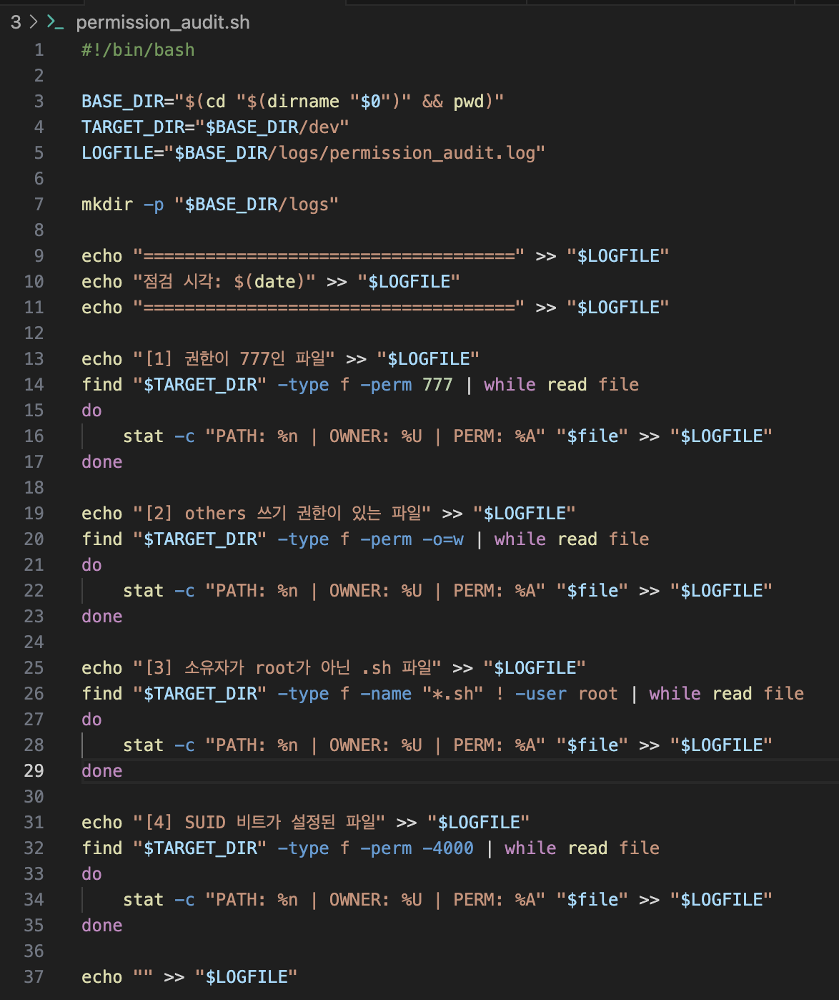
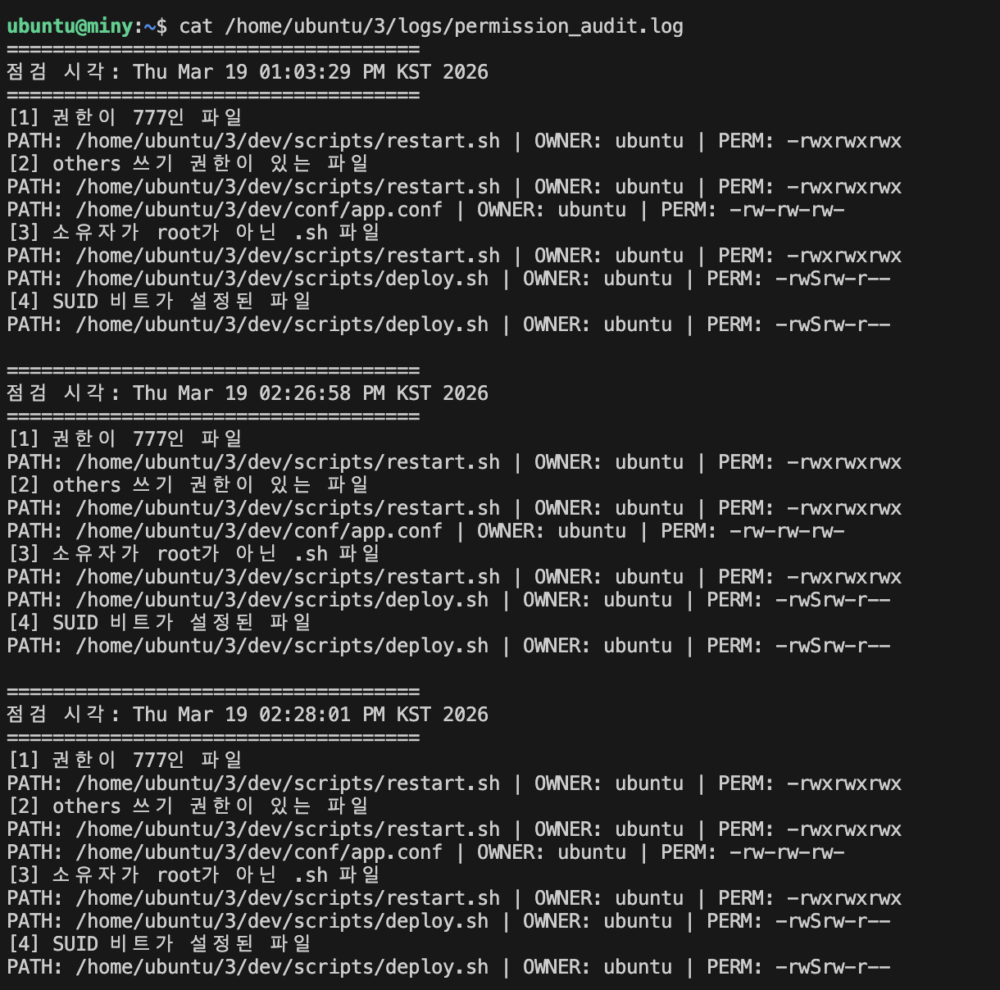

# ❓문제 3. 파일 권한 및 소유자 점검 자동화 문제

## 📚가정 상황
배포 전 점검 과정에서 개발팀의 스크립트와 설정 파일 중 **권한이 과도하게 열린 파일**이나 **소유자가 잘못 지정된 스크립트 파일**, **SUID 비트가 설정된 파일**이 있는지 확인해야 한다.

이러한 파일은 무단 수정, 오작동, 보안 취약점으로 이어질 수 있으므로 자동 점검이 필요하다.

---

## 🤔 문제
**/home/ubuntu/3/dev** 디렉터리 하위에서 다음 조건에 해당하는 파일을 찾아 **permission_audit.sh** 스크립트로 자동 점검하시오.

1. 권한이 **777**인 파일
2. **others 쓰기 권한**이 있는 파일
3. 소유자가 **root가 아닌 .sh 파일**
4. **SUID 비트**가 설정된 파일
5. 최종 결과를 **/home/ubuntu/3/logs/permission_audit.log**에 저장
6. **crontab**을 이용해 매일 오전 9시에 자동 실행되도록 구성하시오.

**Keyword:** find, stat, chmod, crontab, SUID

---

## 📝풀이

### 1단계. 디렉터리 및 초기 파일 상태 확인
먼저 실습 디렉터리 구조와 파일 권한 상태를 확인한다.

```bash
ls -l /home/ubuntu/3/dev/scripts
ls -l /home/ubuntu/3/dev/conf
```

초기 결과
```bash
total 0
-rw-rw-r-- 1 ubuntu ubuntu 0 Mar 19 12:58 deploy.sh
-rw-rw-r-- 1 ubuntu ubuntu 0 Mar 19 12:59 restart.sh

total 0
-rw-rw-r-- 1 ubuntu ubuntu 0 Mar 19 12:59 app.conf
```
초기 상태에서는 모든 파일이 664 권한이고 소유자가 ubuntu이므로,
777, others write, SUID 조건은 만족하지 않고 .sh 파일만 소유자 조건에 걸릴 수 있다.

---

### 2단계. 취약 상태 실험을 위한 권한 변경

실습에서 각 조건이 실제로 탐지되도록 파일 권한을 변경한다.
```bash
chmod 777 /home/ubuntu/3/dev/scripts/restart.sh
chmod o+w /home/ubuntu/3/dev/conf/app.conf
chmod u+s /home/ubuntu/3/dev/scripts/deploy.sh
```

### 3단계. 권한 변경 후 상태 확인

변경된 파일 권한을 다시 확인한다.
```bash
ls -l /home/ubuntu/3/dev/scripts
ls -l /home/ubuntu/3/dev/conf
```
변경 후 결과
```bash
total 0
-rwSrw-r-- 1 ubuntu ubuntu 0 Mar 19 12:58 deploy.sh
-rwxrwxrwx 1 ubuntu ubuntu 0 Mar 19 12:59 restart.sh

total 0
-rw-rw-rw- 1 ubuntu ubuntu 0 Mar 19 12:59 app.conf
```
변경 의도

- restart.sh
→ 777 권한으로 설정하여 권한이 과도하게 열린 파일 실험

- app.conf
→ others write 권한을 부여하여 불필요하게 수정 가능한 설정 파일 실험

- deploy.sh
→ u+s 설정으로 SUID 비트가 설정된 파일 실험

### 4단계. 점검 스크립트 작성

조건별 파일을 탐지하고 로그 파일에 기록하는 permission_audit.sh 스크립트를 작성한다.


### 5단계. 실행 권한 부여 및 로그 초기화

스크립트를 실행할 수 있도록 권한을 부여하고 기존 로그를 초기화한다.

```bash
chmod +x /home/ubuntu/3/permission_audit.sh
> /home/ubuntu/3/logs/permission_audit.log
```

### 6단계. 수동 실행 후 로그 확인

스크립트를 직접 실행한 뒤 결과를 확인한다.
```bash
/home/ubuntu/3/permission_audit.sh
cat /home/ubuntu/3/logs/permission_audit.log
```

## ✅정답 결과

실행 결과는 다음과 같이 출력된다.
