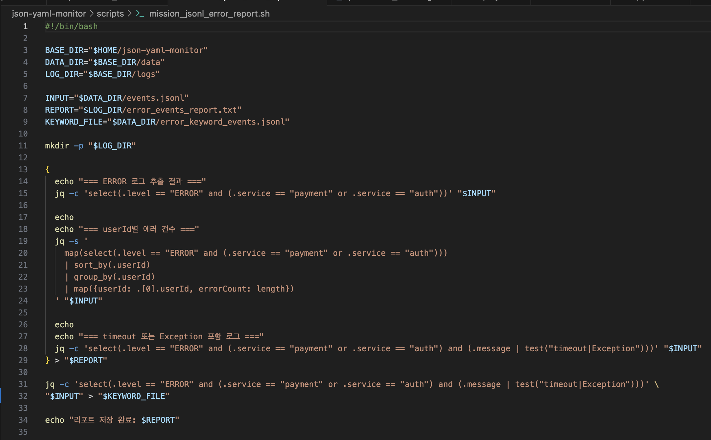
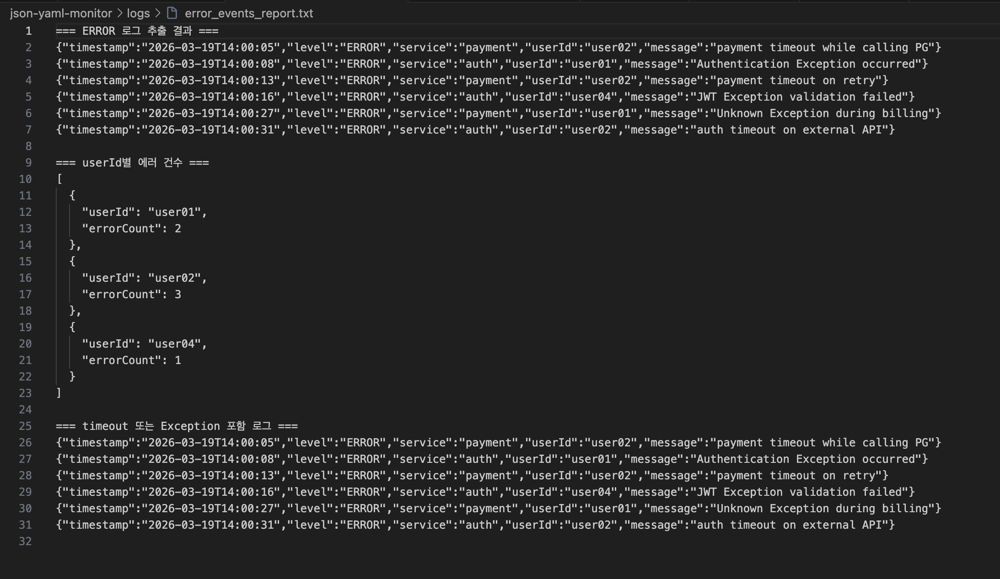
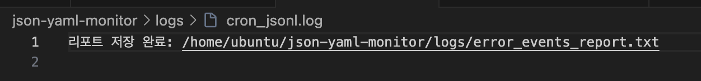

# 2. JSON 로그(JSONL)에서 이상 이벤트 추출 문제

### 📋 가정 상황
운영 중인 서비스에서 특정 시간대에 오류 이벤트가 급증했습니다. 개발팀은 운영팀에게 구조화된 JSON 로그에서 **"ERROR"** 레벨 로그와 **특정 서비스(payment, auth)** 관련 이벤트를 빠르게 추출해 달라고 요청했습니다. 기존의 단순 텍스트 검색 방식보다 JSON 필드를 기준으로 정확히 분석할 수 있는 방법이 필요합니다.

---

### 🚀 문제 정의
**./data/events.jsonl** 파일에서 다음을 수행하시오.

1.  **level**이 "ERROR"인 로그만 추출
2.  **service**가 "payment" 또는 "auth"인 로그만 추출
3.  **userId별** 에러 건수를 집계
4.  **message**에 timeout 또는 Exception이 포함된 로그만 별도 저장
5.  최종 결과를 ./logs/error_events_report.txt에 저장
6.  **crontab**을 이용해 5분마다 자동 실행되도록 구성하시오.

**Keyword:** jq, JSONL, crontab

---

### 💡 풀이 과정

#### 1단계. JSONL 파일 내용 확인
먼저 JSON Lines 형식의 로그 파일 내용을 확인한다. JSONL은 한 줄에 JSON 객체 하나가 저장되는 구조이다.

```bash
cat ./data/events.jsonl
```
#### 2단계. ERROR 로그만 추출하기
전체 로그 중 level 값이 ERROR인 로그만 추출한다.

```bash
jq -c 'select(.level == "ERROR")' ./data/events.jsonl
```

#### 3단계. timeout 또는 Exception 포함 로그만 별도 추출하기
message 필드에 timeout 또는 Exception 문자열이 포함된 로그만 필터링합니다.

```bash
jq -c 'select(.level == "ERROR" and (.service == "payment" or .service == "auth") and (.message | test("timeout|Exception")))' ./data/events.jsonl
```

#### 4단계. userId별 에러 건수 집계하기
대상 서비스(payment, auth)의 에러 로그를 기반으로 사용자별 발생 건수를 집계합니다.

```bash
jq -s '
  map(select(.level == "ERROR" and (.service == "payment" or .service == "auth")))
  | sort_by(.userId)
  | group_by(.userId)
  | map({userId: .[0].userId, errorCount: length})
' ./data/events.jsonl
```

#### 5단계. 키워드 포함 로그를 별도 파일로 저장하기
필터링된 로그를 추후 확인을 위해 별도의 .jsonl 파일로 저장합니다.

```bash
jq -c 'select(.level == "ERROR" and (.service == "payment" or .service == "auth") and (.message | test("timeout|Exception")))' ./data/events.jsonl > ./data/error_keyword_events.jsonl
```
#### 6단계. 최종 결과 리포트 생성
추출 및 집계 결과를 하나의 리포트 파일로 생성하는 쉘 스크립트를 실행합니다.

```bash
# 리포트 생성 스크립트 실행
bash ./scripts/mission_jsonl_error_report.sh

# 생성된 리포트 확인
cat ./logs/error_events_report.txt
```


#### 7단계. 최종 결과를 리포트 파일로 저장하기
추출 결과와 집계 결과를 하나의 리포트 파일에 저장하는 스크립트를 실행한다.

```bash
bash ./scripts/mission_jsonl_error_report.sh
cat ./logs/error_events_report.txt
```
#### 8단계. crontab으로 5분마다 자동 실행하기
로그 분석 스크립트를 5분마다 실행되도록 등록한다.

```bash
crontab -e
```

#### 등록 내용:

```bash
*/5 * * * * /bin/bash /home/ubuntu/json-yaml-monitor/scripts/mission_jsonl_error_report.sh >> /home/ubuntu/json-yaml-monitor/logs/cron_jsonl.log 2>&1
```
✅ 정답 결과

1. ERROR + payment/auth 로그 추출 결과

2. userId별 에러 건수 집계 결과

3. timeout 또는 Exception 포함 로그 저장 결과


4. 자동 실행 확인 결과 (cron_jsonl.log)
