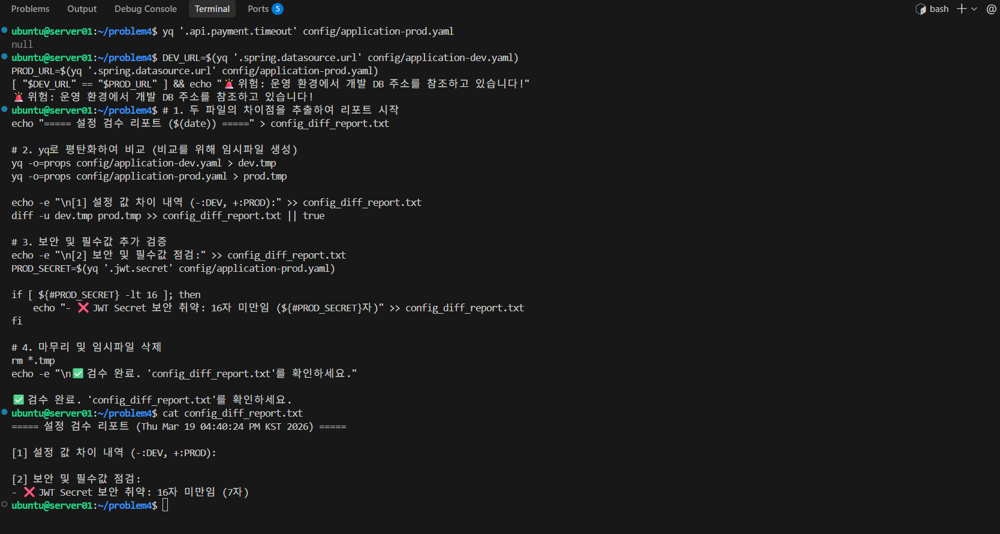

#  ❓문제 4 - 서비스 가용성 확보를 위한 임시 파일 자동 정리

## 📚가정 상황
- 당신은 DevOps 엔지니어입니다. 
- 새로운 서비스 배포 직전, 개발 환경(dev)과 운영 환경(prod)의 설정 파일 불일치로 인한 장애를 막기 위해 검수 스크립트를 작성해야 합니다.

## 🤔문제
### 4-1.
> config/ 폴더 내에서 application-으로 시작하는 .yaml 파일을 찾고, application-prod.yaml의 전체 구조를 Properties 형식으로 출력하시오.
### 4-2.
> application-prod.yaml에 api.payment.timeout 키가 없으면 경고 문구를 출력하시오.
### 4-3.
> 개발(dev)과 운영(prod)의 spring.datasource.url이 같으면 경고를 출력하시오.
### 4-4.
> 운영 환경의 jwt.secret이 16자 미만이면 에러를 내고 종료하시오.
### 4-5.
> 두 파일의 모든 차이점을 주석 없이 config_diff.txt에 저장하고 완료 시간을 기록하시오.

## 📝풀이
### [환경 세팅]
##### 실습 파일 자동 생성 스크립트
```
mkdir -p config

   cat <<EOF > config/application-dev.yaml
   server:
     port: 8080
   spring:
     datasource:
       url: jdbc:mysql://dev-db.internal:3306/mydb
       username: dev_user
       password: dev_password
   api:
     payment:
       endpoint: https://dev-payment.api.com
       timeout: 3000
   logging:
     level:
       root: DEBUG
   jwt:
     secret: "dev-secret-key-1234567890"
     expiration: 3600
   EOF
   
   cat <<EOF > config/application-prod.yaml
   server:
     port: 8080
   spring:
     datasource:
       url: jdbc:mysql://prod-db.internal:3306/mydb
       username: prod_user
       password: prod_password
   api:
     payment:
       endpoint: https://payment.api.com
   logging:
     level:
       root: INFO
   jwt:
     secret: "short"
   EOF
   
   echo "✅ 실습 환경 준비 완료! 'config' 폴더를 확인하세요."
```

### 4-1. 설정 파일 탐색 및 구조 확인
#### [정답]
```
# 1. 파일 찾기
find config/ -name "application-*.yaml" -o -name "application-*.yml"

# 2. 구조 확인
yq -o=props config/application-prod.yaml
```
#### [명령어 설명]
###### YAML의 계층 구조를 a.b.c. = value 형태의 Properties 포맷으로 출력. 
##### 복잡한 들여쓰기를 한 줄의 텍스트로 변환하여 구조 파악이 쉽게 만들어줌.
```
yq -o=props
```
### 4-2. : 특정 환경(Prod)의 설정 누락 여부 검사
#### [정답]
```
[ "$(yq '.api.payment.timeout' config/application-prod.yaml)" == "null" ] && echo "WARNING: Timeout setting missing!"
```
#### [명령어 설명]
##### 점(.)으로 구분된 경로를 따라가 해당 값을 가져옵니다. 만약 해당 경로에 데이터가 없으면 yq는 문자열 null을 반환합니다.
```
yq '.api.payment.timeout'
```
##### 명령어 치환으로 괄호 안의 실행 결과를 텍스트로 가져와 비교문에 넣습니다.
```
$( ... )
```
##### 단축 평가 방식으로 앞의 조건( [ … ] )이 참이면 && 뒤의 명령어를 실행합니다.
```
[ A == B ] && C
```
### 4-3. : 환경 간 데이터베이스 URL 불일치 리포트 생성
#### [정답]
```
DEV_URL=$(yq '.spring.datasource.url' config/application-dev.yaml)
PROD_URL=$(yq '.spring.datasource.url' config/application-prod.yaml)

if [ "$DEV_URL" == "$PROD_URL" ]; then
    echo "🚨 CRITICAL: Dev DB used in Prod!"
fi
```
#### [명령어 설명]
##### yq로 추출한 DB 접속 주소를 변수에 저장합니다.
```
VAR=$(...)
```
##### 두 변수의 값이 일차하는지 비교한 뒤, 운영 서버 설정 파일에 실수로 개발용 DB 주소가 적혀있는 사고를 막는 로직입니다.
```
if [ "$A" == "$B" ; then
```
### 4-4.  : 보안 준수 사항 검사 (Secret Key 검증)
#### [정답]
```
PROD_SECRET=$(yq '.jwt.secret' config/application-prod.yaml)
if [ ${#PROD_SECRET} -lt 16 ]; then
    echo "❌ ERROR: JWT Secret is too short."
    exit 1
fi
```
#### [명령어 설명]
##### shell script의 내장 기능으로, 변수에 담긴 문자열의 길이를 반환합니다. 
```
${PROD_SECRET}
```
##### 스크립트를 비정상 종료 상태 코드로 마칩니다. CI/CD 파이프라인에서 이 명령어를 만나면 배포가 즉시 중단됩니다.
```
exit 1
```
### 4-5. : 최종 검수 자동화 및 리포트 파일 저장
#### [정답]
```
# 1. 평탄화된 임시 파일 생성
yq -o=props config/application-dev.yaml > dev.tmp
yq -o=props config/application-prod.yaml > prod.tmp

# 2. 비교 결과 저장
echo "--- Configuration Diff Report ---" > config_diff.txt
diff -u dev.tmp prod.tmp >> config_diff.txt || true

# 3. 마무리
echo "검수 완료 시간: $(date)" >> config_diff.txt
rm *.tmp
```
#### [명령어 설명]
##### Unified diff 모드로, 바뀐 부분만 보여주는게 아니라, 변경된 줄의 앞뒤 문맥을  + (추가), - (삭제) 기호와 함께 보여주어 가독성이 매우 뛰어납니다.
```
diff -u
```
##### diff는 두 파일이 다르면 종료 코드 1을 반환합니다. 스크립트가 여기서 멈추지 않고 다음 단계(시간 기록)로 넘어가기 위해서 에러가 나도 성공한것으로 간주해라는 의미로 붙여줍니다.
```
|| true
```

## ✅정답 결과


