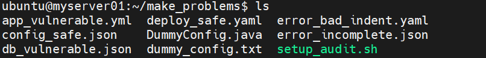
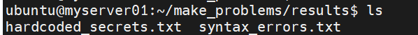
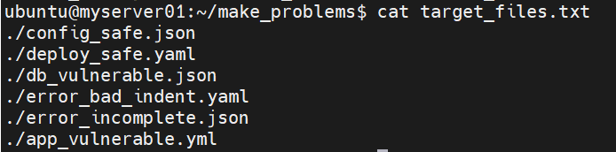
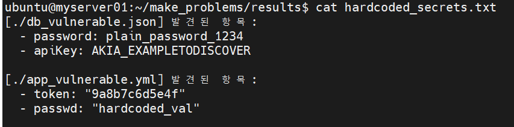
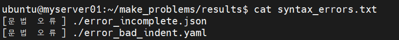

# 🔐문제5: Shell 스크립트를 활용한 JSON/YAML 설정 파일 보안 및 문법 자동 감사

## 📚가정 상황

배포 직전, 보안팀이 “설정 파일과 샘플 데이터 파일에 비밀번호, API 키, 토큰이 평문으로 남아 있지 않은지” 최종 점검하라고 요청했다.

---

## 🤔문제

프로젝트 디렉토리 아래의 ```.json, .yaml, .yml``` 파일을 대상으로 다음을 수행하시오.

1. **```password, passwd, secret, token, apiKey``` 값이 하드 코딩 되었거나 비어있는 JSON/YAML 파일을 찾기**

    - 결과를 **hardcoded_secrets.txt** 에 저장

2. **문법 오류가 있는 JSON/YAML 파일을 찾아 저장**

    - 결과를 **syntax_errors.txt**에 저장


### 테스트 데이터
- setup_audit.sh를 사용하여 총 6개의 json 및 yaml파일 및 txt 파일 1개, java 파일 1개 생성.

**1. 데이터 생성 쉘 스크립트**

```jsx
# 1. 정상 파일 (환경 변수 사용 - 통과 대상)
cat <<EOF > config_safe.json
{
  "db": {
    "user": "admin",
    "password": "\${DB_PASSWORD}",
    "apiKey": "\${CLOUD_KEY}"
  }
}
EOF

cat <<EOF > deploy_safe.yaml
spec:
  containers:
    - name: app
      env:
        - name: SECRET_TOKEN
          value: "\${AUTH_TOKEN}"
EOF

# 2. 문법 오류 파일 (Syntax Error)
echo '{"status": "active", "list": [1, 2, ' > error_incomplete.json
echo -e "services:\n  web:\n    image: nginx\n      bad_indent: true" > error_bad_indent.yaml

# 3. 하드코딩된 민감 정보 파일 (Vulnerable)
cat <<EOF > db_vulnerable.json
{
  "password": "plain_password_1234",
  "apiKey": "AKIA_EXAMPLETODISCOVER"
}
EOF

cat <<EOF > app_vulnerable.yml
auth:
  token: "9a8b7c6d5e4f"
  passwd: "hardcoded_val"
EOF

# 4. 필터링 테스트용 파일 (검색 제외 대상)
cat <<EOF > dummy_config.txt
서버 접속 정보 및 토큰 관리 문서
비밀번호: password1234
발급받은 apiKey: ignore_txt_key_999
EOF

cat <<EOF > DummyConfig.java
public class DummyConfig {
    private String password = "java_hardcoded_password";
    private String apiKey = "java_dummy_api_key";
}
EOF

echo "테스트 데이터 생성 완료"
```
<br>

**2. 스크립트 권한 부여**

``` chmod +x setup_audit.sh ```
- 쉘 스크립트에 실행권한을 부여

<br>

**3. 쉘 스크립트 실행**
```jsx
# 데이터 생성
./setup_audit.sh

```

### 데이터 생성 결과


---

## 📝풀이

### 1단계. 결과를 저장할 로그 파일 지정 및 초기화
> 결과를 저장할 txt 파일을 results 폴더에 생성하고, 검색할 키워드 목록을 쉘 변수에 임시 저장
```bash
export SYNTAX_LOG="results/syntax_errors.txt" SECRET_LOG="results/hardcoded_secrets.txt" TARGET_KEYS="password|passwd|secret|token|apiKey"; > "$SYNTAX_LOG"; > "$SECRET_LOG"
```



### 2단계: 대상 파일 검색 및 모아두기
> json, yaml, yml 파일만 찾아서 ```target_files.txt``` 파일에 모아두기
``` bash
find . -type f \( -name "*.json" -o -name "*.yaml" -o -name "*.yml" \) > target_files.txt
```



### 3단계: JSON 파일 분리 및 처리
> 목록에서 grep 명령어를 사용하여 ```.json``` 파일만 걸러내어 ```jq```로 문법 오류와 하드코딩된 값을 검사하고 ```txt``` 파일에 기록

```bash
cat target_files.txt | grep "\.json$" | while read file; do
    if ! jq . "$file" >/dev/null 2>&1; then
        echo "[문법 오류] $file" >> "$SYNTAX_LOG"
    else
        res=$(jq -r --arg keys "$TARGET_KEYS" 'paths(scalars) as $p | select($p[-1] | test($keys; "i")) | getpath($p) as $v | select($v | test("^\\$\\{.*\\}$") | not) | "\($p | join(".")): \($v)"' "$file")
        if [[ -n "$res" ]]; then
            echo -e "[$file] 발견된 항목:\n$(echo "$res" | sed 's/^/  - /')\n" >> "$SECRET_LOG"
        fi
    fi
done
```

### 4단계: YAML/YML 파일 분리 및 처리
> 목록에서 ```grep``` 명령어를 사용하여 ```.yaml``` 및 ```.yml``` 파일만 걸러내어 ```yq```로 문법 오류와 하드코딩된 값을 검사하고 ```txt``` 파일에 기록
```bash
cat target_files.txt | grep -E "\.(yaml|yml)$" | while read file; do
    if ! yq "." "$file" >/dev/null 2>&1; then
        echo "[문법 오류] $file" >> "$SYNTAX_LOG"
    else
        res=$(yq "." "$file" | grep -iE "($TARGET_KEYS):\s*\"?[^\$]" | grep -v "\${")
        if [[ -n "$res" ]]; then
            echo -e "[$file] 발견된 항목:\n$(echo "$res" | sed 's/^[[:space:]]*/  - /')\n" >> "$SECRET_LOG"
        fi
    fi
done
```

---
## ✅정답 결과
### 1. 키 값이 하드코딩 된 파일을 저장한 hardcoded_secrets.txt 



### 2. 문법 에러가 있는 파일을 저장한 syntax_errors.txt 




